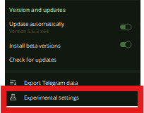
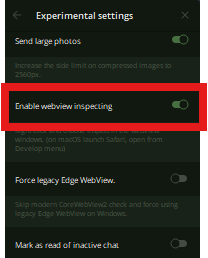

# Tomarket -  AUTO CLAIM FOR TOMARKET


🔗 **Buy & Sell Here** : [TELEGRAM HOT DEAL SHOP](https://t.me/THDShop)

🔗 **CLIK TO GET USER/QUERY** : [TOMARKET](https://t.me/Tomarket_ai_bot/app?startapp=0001dJzb)

Farm TOMATO with me and secure your token allocation through Tomarket.ai!

I've prepared a warm welcome meal just for you! 🍅

Use my link to get 50,000 TOMATO! Limited time offer.)

## 📢 Telegram Channel & Group

Join our Telegram Channel & group to stay updated and get instructions on how to use this tool:

- [AirdropAlertTrends - Channel](https://t.me/AIRDROPALERTTRENDS)
- [QD FORUM - Group](https://t.me/QDforum)
- [I recommend you Share Our page ](https://t.me/addlist/3oHlY2NsIfdiMjc0)
- If you want to buy a Gadget or Sell at MRATOTECH, please DM us.

## 📢 Youtube Channel
- [AirdropAlertTrends - Channel](https://www.youtube.com/@AIRDROPALERTTRENDS)

## 🚀 Run File Termux/Terminal

## Prerequisites

- **Termux**:  A terminal emulator and Linux environment app for Android.
- **Python**: Python version 3.x should be installed on Termux.

## Install

Follow these steps to install and run the script on Termux:

## Note: Skip step 1. - 3. if your are using PC.

1. **Install Termux:**
   - Download and install Termux from [F-Droid](https://f-droid.org/packages/com.termux/).

2. **Update and Upgrade Termux:**
```
pkg update
pkg upgrade
```

3. **Instal Python:**
```
pkg install python
```
## Note: Skip step 1. - 3. if your are using PC.

4. **Clone Repository or Copy Script::**
```
git clone https://github.com/mratotech/tomarketApp.git 
```
4. **Change Directory:**
```
cd tomarketApp
```
5. **Install Dependencies:**
```
python -m pip install -r requirements.txt
```
6.**Run the Script:**
```
python bot.py
```
## 🤖For PC user this is how you get the user_id or query_id from the Telegram Mini App .
1.Open Telegram Goto Settings>Advanced>Eperimental Settings>Enable Webview Inspecting (Save and Restart)

**Eperimental Settings**

**Enable Webview Inspecting **

2.


| Run with Proxy                   | Run without Proxy   |
| -------------------------------- | ------------------- |
| `nano data.txt` `python bot.py` | `bot.py` `data.txt` |

## ⚠️ Note

- Get auth data (`query_id=... /user=...`) in the `Application` tab in DevTools.
- Auto features: Change `false` to `true` in the `config.json` file.
- Supported commands: `/run_bot` `/query_id` `/proxy` `/proxy_web` (Join group to use these commands).

## 💱 Support Me

- (Global/International): https://mratotech.github.io/
- Ton: ```UQBsVMARBTpJWaL46rjeUzLVoOBrvFbpOl68FEUuGY4vL_nt```
- Dogs: ```UQCVNZZ0m3ECDY8n-hsV4u4JO700ye9cdEJY_f0BSN49do3v```
- PAYPAL: https://www.paypal.com/paypalme/mratotech/
- Momo(MTN GHANA): ```+233 557719394```
- TELECEL CASH (TELECEL GHANA): ```+233 506671286```
- AT CASH (AT GHANA): ```+233 579027980```

## Disclaimer⚠️:

This is a research project intended for educational purposes and testing in controlled environments only. I am not responsible for any misuse of this tool, including account bans or damages. Use it at your own risk. I do not endorse using malware, harmful software, or joke programs on your own or others' devices, as this can have serious consequences. Be cautious and avoid self-infection when working with malicious software.

